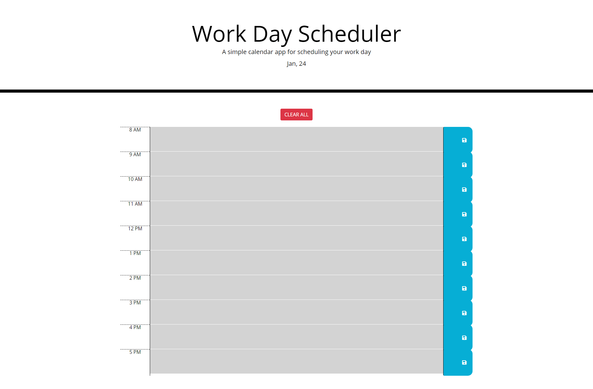

# Day-Planner

## Ready to schedule your day!? 

This is an easy to use day planner for all you 8am-5pm scheduling needs! The planner indicates wether your event is the in the future(green background), present(red background), or it's already in the past(grey background). 

Below I have a screenshots of the application.

## Instructions

- Click on the input area and type in any appointment/plans!
- Click on the save icon on the right and your input will be saved to your local storage, so don't worry if you accidentally hit the refresh button, your info will still be there!
- click the clear all button to reset your page!

## Usage
This is a simple responsive sight and has
 - css
 - html
 - bootstrap
 - javascript
 - day.js

## Credits
Credit to [Mike Fearnley](https://michaelfearnley.com/) and [Scott Byers](https://github.com/switch120)

and the UNH Fullstack Coding Bootcamp

## Links 
Here is the link to the deployed site: https://taylorgonz.github.io/day-planner/
## Contact

if you want to contact me for any more questions here are my links!

hello@taylorgonz.com
 
[Website](http://www.taylorgonz.com)

## Licensing
 [General Public License](https://opensource.org/licenses/GPL-2.0)
